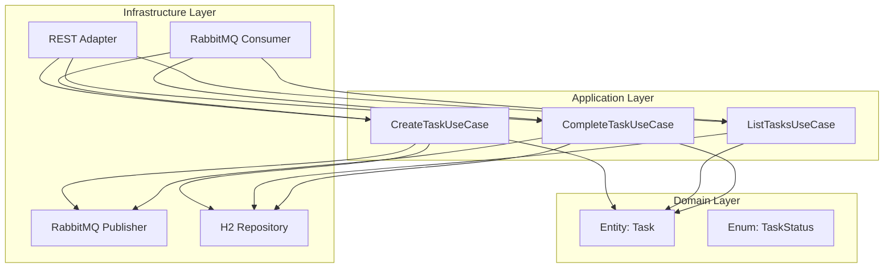

# HexaTask

**HexaTask** é uma aplicação de gerenciamento de tarefas desenvolvida com **Spring Boot** aplicando os princípios da **Arquitetura Hexagonal (Ports & Adapters)**. O projeto demonstra, de forma simples e prática, como separar as camadas de domínio, aplicação e infraestrutura, permitindo diferentes formas de interação com o mesmo caso de uso.

---

## 📄 Descrição

A aplicação permite criar, listar e marcar tarefas como concluídas. As operações podem ser realizadas tanto via **API REST** quanto via **RabbitMQ**, mostrando como a arquitetura hexagonal possibilita múltiplos adapters para as mesmas portas de entrada.

Banco de dados: **H2 (em memória)**.

---

## 📊 Casos de Uso

1. **Criar tarefa**
    - Endpoint REST: `POST /tasks`
    - Mensagem RabbitMQ: `task.create`

2. **Listar tarefas pendentes**
    - Endpoint REST: `GET /tasks/pending`
    - Mensagem RabbitMQ: `task.list.pending`

3. **Concluir tarefa**
    - Endpoint REST: `PATCH /tasks/{id}/complete`
    - Mensagem RabbitMQ: `task.complete`

4. **Listar todas as tarefas**
    - Endpoint REST: `GET /tasks`
    - Mensagem RabbitMQ: `task.list.all`

---

## 🔄 Arquitetura Hexagonal

A estrutura é baseada em três camadas principais:

### 1. Domínio (`domain`)
Contém as regras de negócio e as entidades centrais, como `Task` e o enum `TaskStatus`.

### 2. Aplicação (`application`)
Contém os **casos de uso** (use cases) e as **portas** (interfaces) de entrada e saída:
- **Ports IN**: interfaces que definem o que o sistema pode fazer (ex: `CreateTaskUseCase`).
- **Ports OUT**: interfaces que definem o que o sistema precisa de fora (ex: `TaskRepository`, `TaskEventPublisher`).

### 3. Infraestrutura (`infra`)
Contém as implementações concretas das portas:
- **Adapters IN**: REST Controller e RabbitMQ Consumer.
- **Adapters OUT**: Repositório (H2) e Publisher (RabbitMQ).

---

## 🖌️ Diagrama Conceitual



---

## 🚀 Tecnologias Utilizadas

- **Java 17+**
- **Spring Boot 3**
- **Spring Web**
- **Spring AMQP (RabbitMQ)**
- **Spring Data JPA**
- **H2 Database**
- **Lombok**
- **MapStruct** (opcional para mapeamentos)

---

## 🔧 Estrutura de Pacotes (exemplo)

```
com.example.hexatask
├── application
│   ├── ports
│   │   ├── in
│   │   └── out
│   └── usecases
├── domain
│   ├── model
│   └── enums
├── infra
│   ├── adapters
│   │   ├── in
│   │   │   ├── rest
│   │   │   └── amqp
│   │   └── out
│   │       ├── db
│   │       └── amqp
│   └── config
└── HexaTaskApplication.java
```

---

## 📈 Possíveis Extensões Futuras

- Adicionar autenticação JWT.
- Substituir o H2 por PostgreSQL.
- Criar testes unitários com **MockBean** para portas de saída.
- Adicionar um terceiro adapter (ex: CLI ou gRPC) para demonstrar mais flexibilidade.

---

## 📑 Licença

Este projeto é distribuído sob a licença MIT. Veja o arquivo `LICENSE` para mais detalhes.

---

### 🌐 Autor
**Felipe Matheus**  
Desenvolvedor Java | Estudante de Arquitetura de Software  
[LinkedIn](https://www.linkedin.com/in/felipe-matheus-34232b162/) | [GitHub](https://github.com/felipematheus1337)
